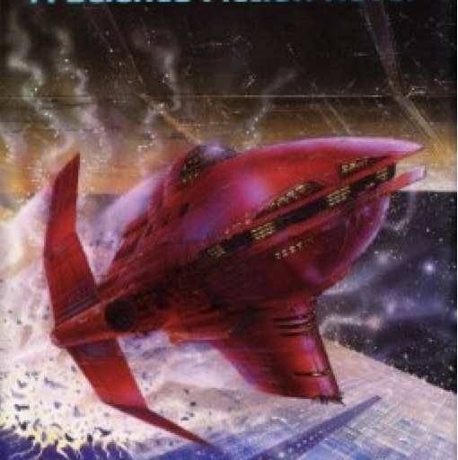

# Iain M. Banks: Consider Phlebas

This is a
[Text-Fabric](https://githubv.com/annotation/text-fabric)
example app for working with
a mini corpus consisting of just 99 words from the book
[Consider Phlebas](https://en.wikipedia.org/wiki/Consider_Phlebas)
by the late
[Iain M. Banks](https://en.wikipedia.org/wiki/Iain_Banks),
a Scottish writer of phantasy and SF novels.

This corpus serves several functions

* an exposition of all aspects of text-fabric but with a tiny amount of data;
* a test corpus for unit testing;
* an example of how to convert texts to the TF format.

This mini-corpus is documented in the
[notebook](https://nbviewer.jupyter.org/github/annotation/tutorials/blob/master/text-fabric/convert.ipynb)
that generated the Text-Fabric data set for these quotes.

It offers this [API](https://annotation.github.io/text-fabric/Api/App/).
